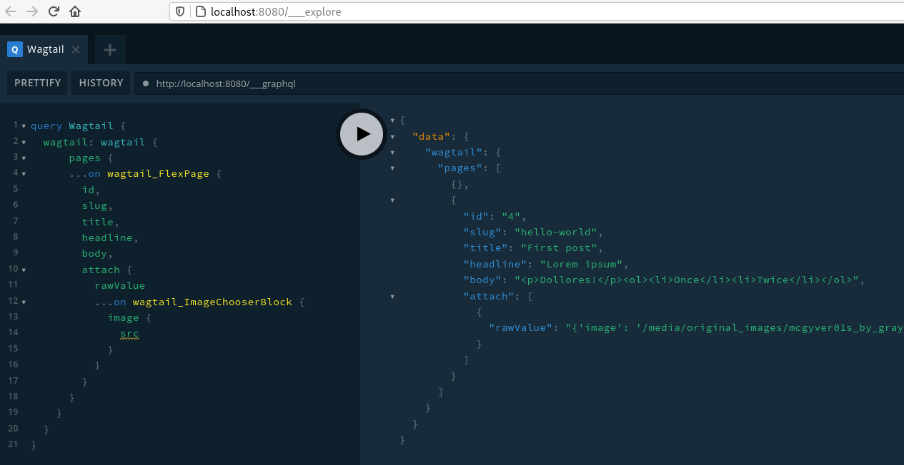

# Wagtail on Gridsome

This is a boilerplate project that demonstrates how to use [Wagtail CMS](https://github.com/wagtail)
with a [Vue.js](https://vuejs.org/) frontend based on [Gridsome](https://gridsome.org/),
a modern PWA engine with support for GraphQL and other data sources. It makes it easier to deploy Wagtail as a self-hosted headless CMS for high-performance hosting on CDN platforms.

_"Wagtail is not an instant website in a box."_ --[Zen of Wagtail](https://github.com/wagtail/wagtail/blob/main/docs/getting_started/the_zen_of_wagtail.md)

## Installation

After you follow the [Deployment](#Deployment) steps below, the Wagtail-Django server will run on port `8000`, while the
Node.js server compiling the Vue.js app will run on port `8080`.

To access the Wagtail admin go to http://localhost:8000/admin/ - and then
login with the superuser you created with the `createsuperuser` command. If the setup
succeeded, you should be able to edit the content of a default home page.

When you switch to the Gridsome frontend in http://localhost:8080 - you should
see the contents you have edited.

The frontend app is expecting a GraphQL API to be available at `localhost:8000/graphql`.
The regular Django API is available at `localhost:8000/api/v2/`.

## Configuration

Create a file at `django/website/wagtail_vue/wagtail_vue/settings/local_dev.py` if you wish to override any settings from `dev.py`.

## Deployment

Deployment with [Docker Compose](https://docs.docker.com/compose/install/) should be rather quick:

`make up`

If anything fails, you can go through the build steps defined in the [Makefile](Makefile):

```
# build image, start and enter container
make refresh

# initialize database (inside container)
django-admin.py migrate
django-admin.py createsuperuser

# start django server (inside container)
django-admin.py runserver 0.0.0.0:8000

# ..or use the handy aliases:
djm
djr

# enter frontend (Gridsome) container
make frontend

# start node server (inside container)
gridsome develop

# stop and remove containers
make clean
```

## Development

The frontend interfaces with Wagtail using the GraphQL API as mentioned above through the [Wagtail Grapple](https://wagtail-grapple.readthedocs.io/en/latest/) library.



We suggest using Gridsome's default Query tool available at http://localhost:8080/___explore (pictured above). Once you've set up your models and queries, add them to the frontend using Gridsome's [GraphQL data layer](https://gridsome.org/docs/data-layer/) - see [Index.vue](gridsome/src/pages/Index.vue).

Alternatively, use the [Altair GraphQL client](https://altair.sirmuel.design/#download) or similar to connect with the service. A query directly to the GraphQL interface to get page model data might look like this:

```graphql
{
  pages {
    ...on FlexPage {
      title,
      headline,
      body,
      attach {
        rawValue
        ...on ImageChooserBlock {
          image {
            url
          }
        }
      }
    }
  }
}
```

You can generate a [schema.json](schema.json) reflecting the current page model with the following command:

`django-admin graphql_schema`

## Acknowledgements

Thanks to Bryan Hyshka and Kalob Taulien for the project [hyshka/wagtail-vue-talk](https://github.com/hyshka/wagtail-vue-talk) which laid the foundations here, and to the entire Wagtail team and community for a fantastic product.

[MIT License](LICENSE)
